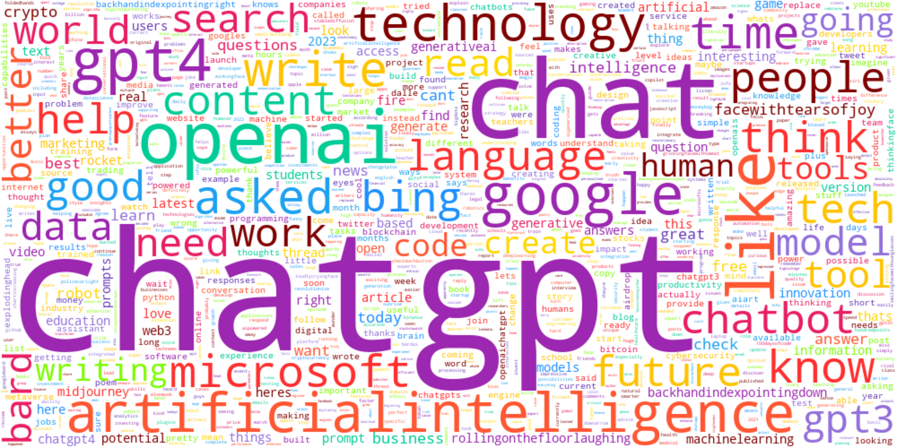
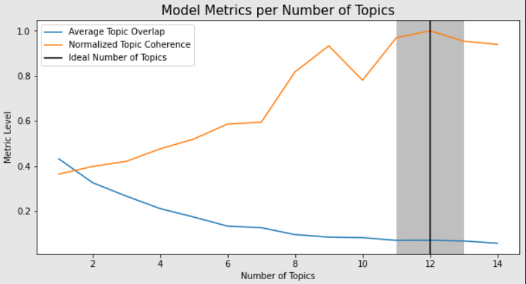
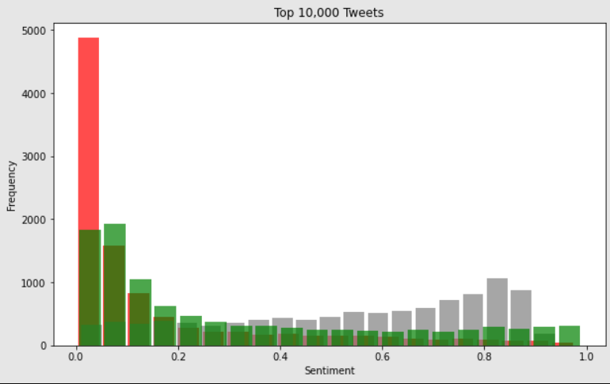
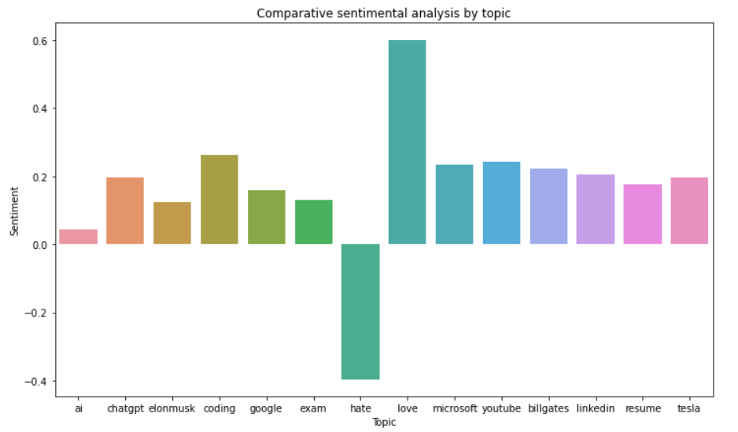

# ChatGPT-Tweet-Analysis
#### **Current Status: Done**

## Objective
The objective of this GitHub repository is to explore and analyze the usage of ChatGPT through sentiment analysis, visualization, and topic modeling techniques. The goal is to gain insights into how ChatGPT is used and what people say about it on Twitter. 
<!--Additionally, we aim to identify which professions are utilizing ChatGPT the most.-->

## Dataset
We will combine existing data from Kaggle and data obtained through the Twitter API. By combining these sources, we aim to create a comprehensive dataset that includes a diverse range of tweets related to our research topic. 

Dataset Source 1: [Kaggle](https://www.kaggle.com/datasets/khalidryder777/500k-chatgpt-tweets-jan-mar-2023)
<!-- [comment]: #  The dataset used in this project will be made publicly available in the data directory of this GitHub repository. -->

Dataset Source 2: [Twitter](https://github.com/Prathyush-k/ChatGPT-Tweet-Analysis/blob/main/code/Scrape_Twitter.py) 
This has the code to scrape data from Twitter using keywords

## Tools
#### *Done*

The following tools and libraries will be used in this project:

1) **Python:** A popular programming language for data analysis and machine learning.
2) **Pandas:** A Python library used for data manipulation and analysis.
3) **Matplotlib:** A Python library for data visualization and plotting.
4) **WordCloud:** It is a visual representation of text data where the size of each word indicates its frequency within the given text.
5) **Gensim:** A Python library for topic modeling, document similarity, and natural language processing (NLP) tasks.
6) **Transformers:** A Python library that provides pre-trained models and utilities for natural language processing (NLP), based on the Transformer architecture.
7) **Hugging Face:** It is an open-source platform and community that provides state-of-the-art models and tools for natural language processing (NLP).

## Pre-Processing
Code: [Cleaning Data](https://github.com/Prathyush-k/ChatGPT-Tweet-Analysis/blob/main/code/Clean%20Data.ipynb)
1) Removed Null and duplicate values.
2) Removed Stopwords, emails, and URLs.
3) Changed emojis into the text to keep the semantic meaning ( 😂: face_with_tears_of_joy).
4) Normalized text (Françoiš': Francois).
5) Removed special characters, extra spaces, usernames, etc.

## Descriptive Analysis
Code: [Word Cloud and LDA](https://github.com/Prathyush-k/ChatGPT-Tweet-Analysis/blob/main/code/Word%20Cloud%20and%20Topic%20Modelling.ipynb) 
Code: [Sentiment Analysis](https://github.com/Prathyush-k/ChatGPT-Tweet-Analysis/blob/main/code/Sentiment%20analysis.ipynb)

### Word Cloud
The word cloud visualizes the main words/topics used in tweets during the specified time period.

 

### Latent Dirichlet Allocation (LDA)
We used LDA topic modeling to separate the data into 10 topics. We also have the top words from each of the topics.

#### Grid Search for selecting the best parameters. 
We optimized the Alpha value and the number of topics selected using grid search.
The best topics should have the least similarity among themselves and the highest coherence.

Implemented code to select the best parameters for the LDA model which has the least jaccard_similarity and highest u_mass coherence.

**Alpha value:**  0.2 **Number of Topics:**  12

### Sentiment Analysis
Hugging Face model is utilized for sentiment analysis of the top 10k tweets. The overall sentiment is mostly neutral and positive, with very few negative sentiments. 

We also plotted graphs for each of the topics created by the LDA topic modeling.

#### General topics
Selected a few related topics and plotted the average sentiment of tweets for these topics.

